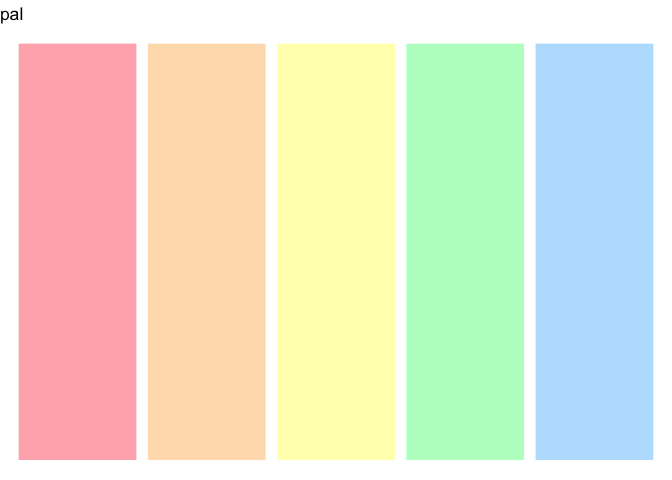
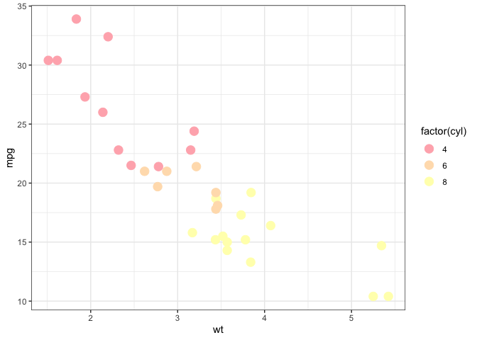
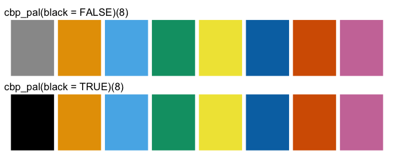
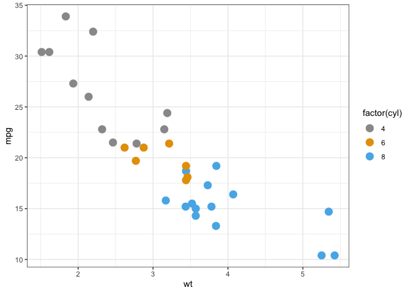

<!-- README.md is generated from README.Rmd. Please edit that file -->

# vizoR

<!-- badges: start -->

<!-- badges: end -->

The goal of vizoR is to provide helper functions to help designing
better visualizations in R.

## Installation

This package is under active developpement. You can install it from
github:

``` r
devtools::install_github("aneuraz/vizoR")
```

## Example

### Retrieving a color palette from [color-hex.com]() (by number)

``` r
library(vizoR)

pal5361 <- color_hex_palette_from_number(5361)
pal5361
#> [1] "#ffb3ba" "#ffdfba" "#ffffba" "#baffc9" "#bae1ff"
```

#### Plotting the palette

``` r
show_pal(pal5361)
```



### Retrieving a color palette from [color-hex.com]() (by name)

``` r
library(vizoR)

palCook <- color_hex_palette_from_name("Cook")
palCook
#> [1] "#236e23" "#1b1b1b" "#d5881c" "#ef3f3f" "#e8e8e8"
```

``` r
show_pal(palCook)
```


### Retrieving a color palette from [colourlovers.com]() (by number)

``` r
palTerra <- colour_lovers_palette_from_number("292482/Terra")
palTerra
#> [1] "#E8DDCB" "#CDB380" "#036564" "#033649" "#031634"
```

``` r
show_pal(palTerra)
```


#### Using the palette

``` r
library(ggplot2)

p <- ggplot(mtcars, aes(wt, mpg))
p + geom_point(size = 4, aes(colour = factor(cyl))) +
  scale_color_manual(values = pal5361) +
  theme_bw()
```



### Using a color-blind proof palette

#### Showing the palettes

``` r
library(patchwork) # devtools.install_github("thomasp85/patchwork")

p1 <- show_pal(cbp_pal(black = FALSE)(8))
p2 <- show_pal(cbp_pal(black = TRUE)(8))

p1 + p2 + patchwork::plot_layout(ncol = 1)
```



#### Using the palettes

``` r

p <- ggplot(mtcars, aes(wt, mpg))
p + geom_point(size = 4, aes(colour = factor(cyl))) +
  scale_color_cbp(black = FALSE) +
  theme_bw()
```


