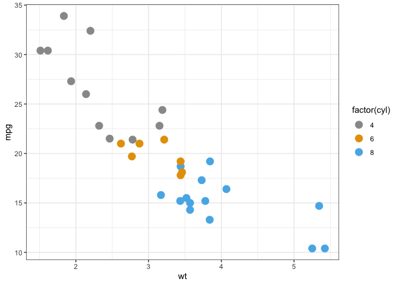

<!-- README.md is generated from README.Rmd. Please edit that file -->

# vizoR

<!-- badges: start -->

<!-- badges: end -->

The goal of vizoR is to provide helper functions to help designing
better visualizations in R.

## Installation

This package is under active developpement. You can install it from
github:

``` r
devtools::install_github("aneuraz/vizoR")
```

## Example

### Retrieving a color palette from color-hex.com (by number)

``` r
library(vizoR)

pal <- color_hex_palette_from_number(5361)
pal
#> [1] "#ffb3ba" "#ffdfba" "#ffffba" "#baffc9" "#bae1ff"
```

Plotting the palette

``` r
show_pal(pal)
```


Using the palette

``` r
library(ggplot2)

p <- ggplot(mtcars, aes(wt, mpg))
p + geom_point(size = 4, aes(colour = factor(cyl))) +
  scale_color_manual(values = pal) +
  theme_bw()
```


### Using a color-blind proof palette

``` r

p <- ggplot(mtcars, aes(wt, mpg))
p + geom_point(size = 4, aes(colour = factor(cyl))) +
  scale_color_cbp(black = FALSE) +
  theme_bw()
```


